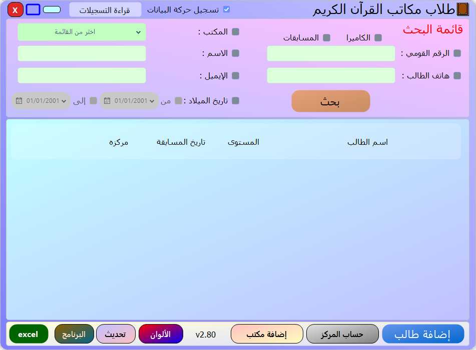
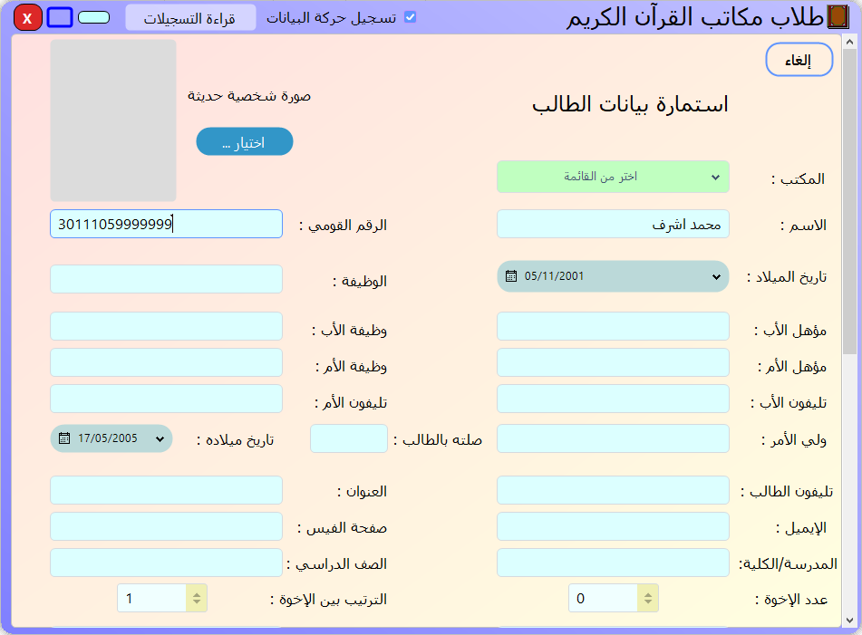
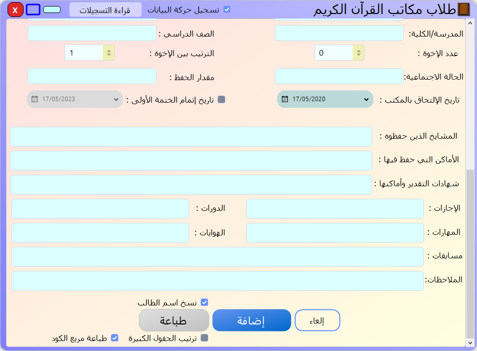
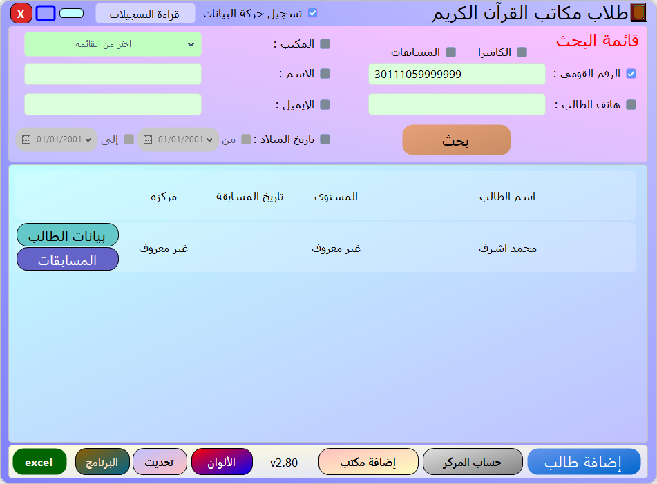
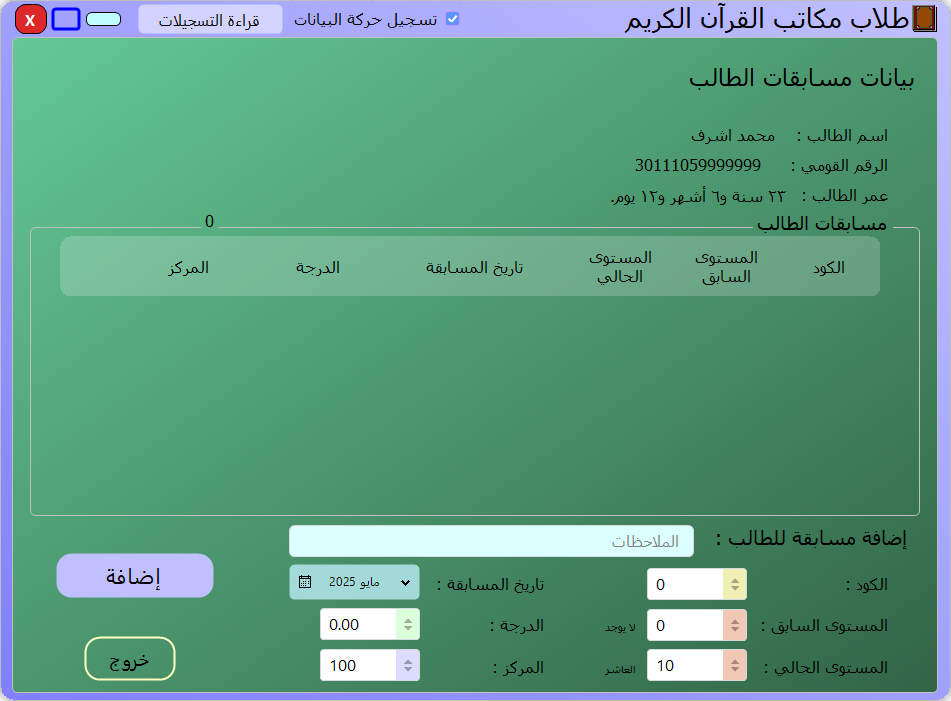

# 📖 Qur'an Recitation Competition Program

This program is built based on the client's requirements.  
A program for managing data on Quran memorizers and the competitions they participated in.

- [Download libraries](https://github.com/MohamedAshref371/little-hafiz/raw/refs/heads/master/libs.zip).
- [Download the executable file](https://github.com/MohamedAshref371/little-hafiz/releases/latest/download/update.zip).
- [Download QRCode Video](https://github.com/MohamedAshref371/little-hafiz/raw/refs/heads/master/Screenshots/06-QRCode.mp4)

My special gifts:

