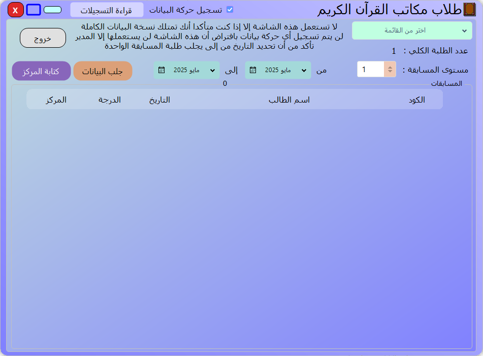

# 📖 Qur'an Recitation Competition Program

This program is built based on the client's requirements.  
A program for managing data on Quran memorizers and the competitions they participated in.

- [Download libraries](https://github.com/MohamedAshref371/little-hafiz/raw/refs/heads/master/libs.zip).
- [Download the executable file](https://github.com/MohamedAshref371/little-hafiz/releases/latest/download/update.zip).

- My special gift: [Download QRCode Video](https://github.com/MohamedAshref371/little-hafiz/raw/refs/heads/master/Screenshots/06-QRCode.mp4)
    - QRCode: (14)(1)(1:5)
        - National ID number
        - Competition level number from 0 to 9, where 0 means 10
        - Competition code from 1 to 65,000

 

 

My another special gift:

 

I got some ideas, such as the following 'Fields Helper (F1)', from the [Al-Shafi](https://www.afi-soft.com/) program.

